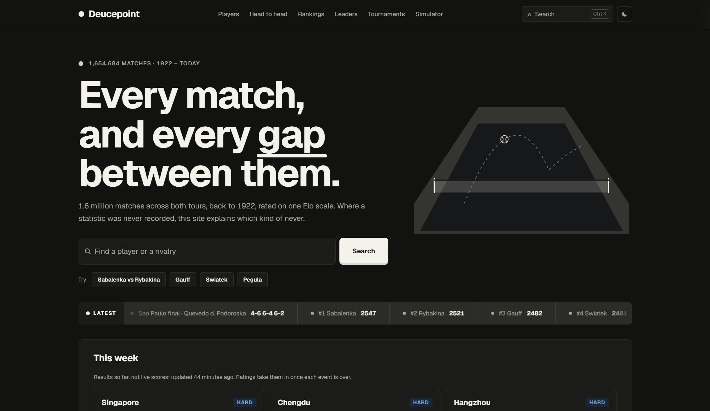
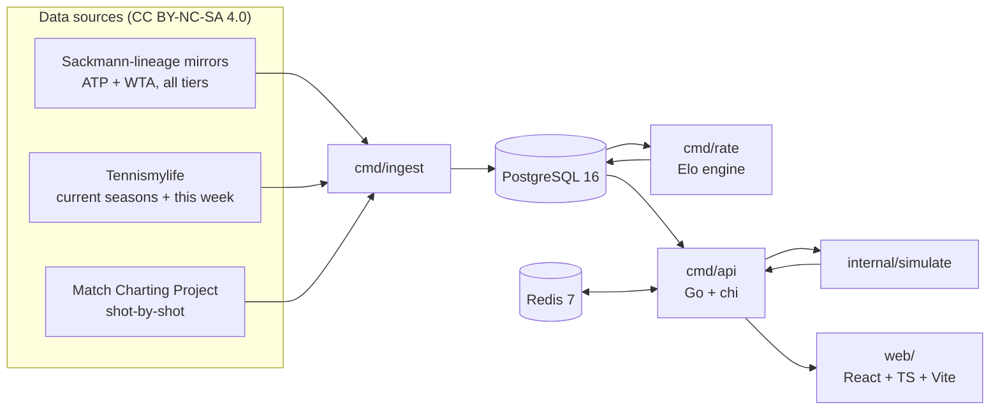

# Deucepoint

Deep per-player statistics, head-to-head comparison, and first-principles match and draw
simulation for **both the ATP and WTA tours** — built from raw match data, with the
working shown.

Note: Claude Code used for frontend design.

**Live:** [deucepoint.net](https://deucepoint.net) — API at [api.deucepoint.net](https://api.deucepoint.net/api/v1/health)

## Why this exists

Three things no free tennis site does well together:

- Deep per-player statistics for **ATP and WTA on the same footing**. Most sites treat the
  women's tour as an afterthought or omit it entirely.
- **Every player, not just the famous ones.** Around 1.6 million matches across tour,
  Challenger, Futures and ITF, and over 115,000 players. A player ranked 400 gets a real
  page, not an empty one — see [ADR-0003](docs/decisions/0003-full-depth-player-coverage.md).
- Head-to-head comparison with **surface, era, and form context** — not just a win-loss
  tally.
- **Match and draw simulation from first principles**, showing every intermediate step
  from point-win probability up to match probability.

The closest prior art, [Ultimate Tennis Statistics](https://github.com/mcekovic/tennis-crystal-ball),
is ATP-only. This project's differentiation is WTA parity, the simulators, and an
interface that is designed rather than assembled.

## Architecture

Go handles ingestion, rating, simulation and the read-only API; PostgreSQL does the
statistical work. The API, Postgres and Redis run on a single k3s node, with a weekly
CronJob catching the data up and an hourly one for this week's results. The frontend is a
static SPA on Cloudflare Pages. Design decisions are recorded in [`docs/decisions/`](docs/decisions/),
and the system and runbook in [`docs/architecture.md`](docs/architecture.md) and
[`docs/deployment.md`](docs/deployment.md).

## Rating methodology

Ratings are computed from scratch over every match, replayed in draw order, with no
ratings imported from anywhere. It is standard Elo with a K-factor that decays with
experience, scaled by how much a match matters (a Grand Slam final at 1.20, Futures at
0.60):

$$K(n) = \frac{250}{(n + 5)^{0.4}}$$

Each player has five series: overall, hard, clay, grass and carpet. For display and
simulation, a surface is blended with overall by how much of it the player has played:

$$\text{blended} = w \cdot \text{surface} + (1 - w) \cdot \text{overall}, \qquad w = \min\left(0.75, \frac{\text{surface matches}}{40}\right)$$

At tour level the ratings pick the winner **69.7%** of the time, two points better than
the official ATP and WTA rankings on the same matches. The full derivation, validation and
simulation chain are in [`docs/methodology.md`](docs/methodology.md), rendered at
[deucepoint.net/methodology](https://deucepoint.net/methodology).

## Data and license

The match data comes from the work of **Jeff Sackmann / [Tennis Abstract](http://www.tennisabstract.com/)**,
licensed [CC BY-NC-SA 4.0](https://creativecommons.org/licenses/by-nc-sa/4.0/), through
license-compliant redistributions, since the original repositories are no longer public.
The site is non-commercial, attributes the source on every page, and redistributes derived
data under the same license. Provenance is in [`DATA_LICENSE.md`](DATA_LICENSE.md).

**Code** is [MIT](LICENSE); **data** is [CC BY-NC-SA 4.0](DATA_LICENSE.md)
([ADR-0001](docs/decisions/0001-dual-license-code-and-data.md)).
